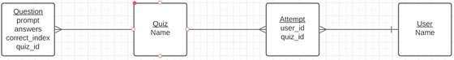

# Quivia Quiz App Database
> [Deployed Repo](https://damp-island-75764.herokuapp.com/quizzes)
> [Front End Repo](https://github.com/Calvinfr96/quiz-app-frontend)

This is a Postgre SQL database built for the [Quivia Quiz App](https://quivia-quiz-app.netlify.app/) using Ruby 2.7.4.

The application was created using the rails generator (`rails new [app name] --api --database=postgresql`) and requires the following additional dependencies to work properly:
- Active Model Serializers - `gem 'active_model_serializers'`
- BCrypt - `gem 'bcrypt', '~> 3.1.7'`
- JSON Web Tokens - `gem "jwt", "~> 2.3"`
- Postgre SQL - `gem 'pg', '~> 1.1'`
- Rack CORS - `gem 'rack-cors'`
- Ruby 2.7.4 - `ruby '2.7.4'`

The database was built using 4 models:
1. Attempt
2. Question
3. Quiz
4. User

The following Entity Relationship Diagram shows how the models relate to one another:

This README would normally document whatever steps are necessary to get the
application up and running.

Things you may want to cover:

* Ruby version

* System dependencies

* Configuration

* Database creation

* Database initialization

* How to run the test suite

* Services (job queues, cache servers, search engines, etc.)

* Deployment instructions

* ...
